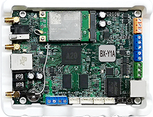
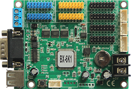

# BX控制器 开发指南

这里是仰邦科技（www.onbonbx.com）二次开发的文档中心。

这里包含所有BX异步控制器二次开发的相关资料。

BX 异步LED控制器，主要包括全彩系列，单双色系列与字库系列三类。

|  |  |  |
| ----------------------------- | ----------------------------- | ----------------------------- |
| [全彩播放器系列](zh/y/y.md)   | [单双色系列](zh/dual/dual.md) | [字库系列](zh/k/k.md)         |
| BX-Y 系列                     | BX-5M/5E/BX-XW BX-6M/6E等 | BX-5K/5MK BX-6K等         |

-----

**联系我们**

您可以通过以下方式来获取我们的二次开发支持：

注：下面的联系方式，仅对二次开发进行支持。如果是关于屏幕使用的问题，请联系您当地或者我们总部的技术支持（https://www.onbonbx.com/service）。

**邮件支持:**

 dev@onbonbx.com

**电话支持:**

0512-65988651

0512-65988652

