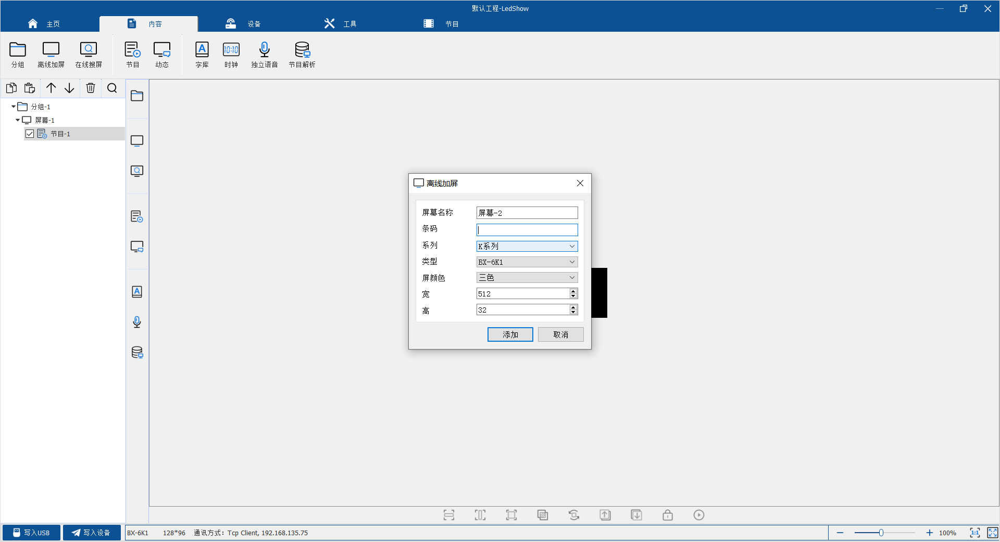
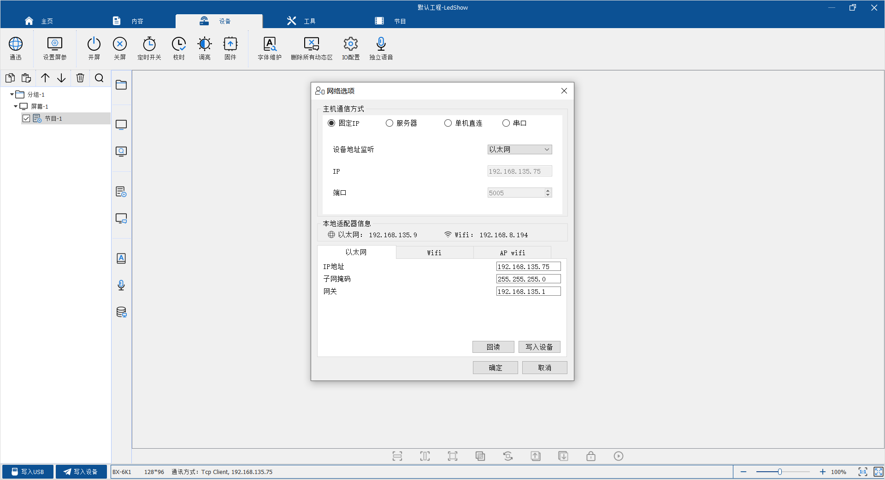
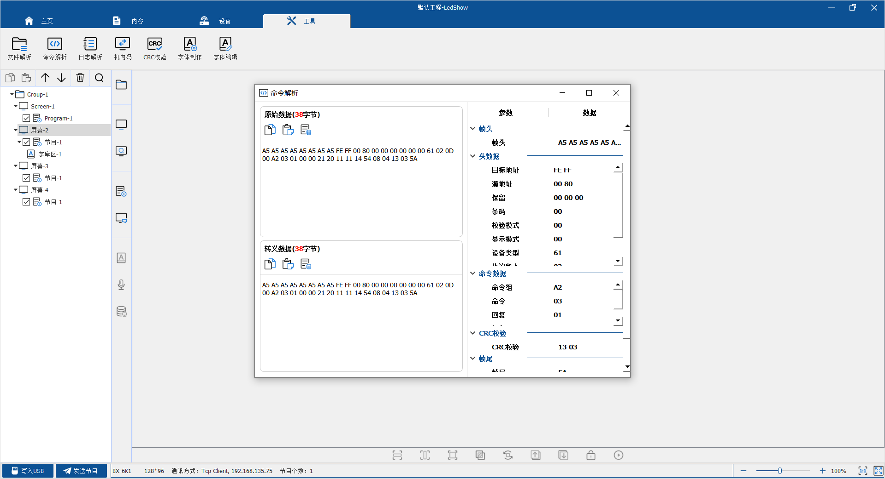
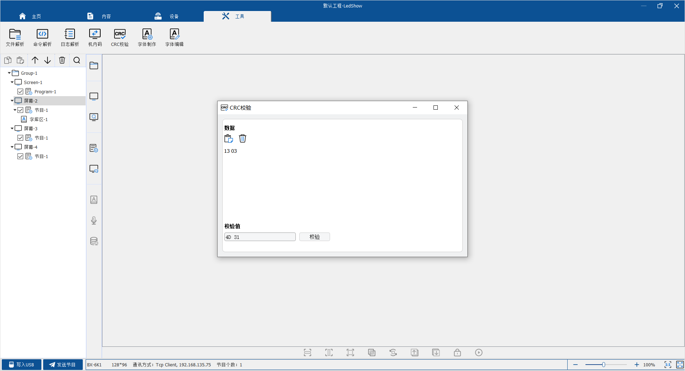
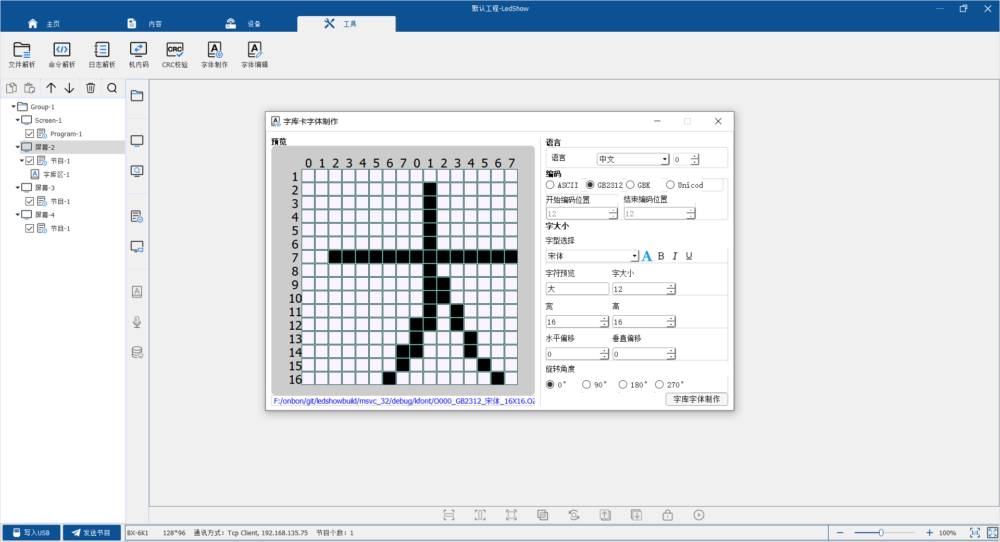

# 开发指南 - 字库系列 

## 1. 你选择的控制器型号正确吗？

### 1.1 什么是字库卡

字库卡是指内置字库文件的LED控制器。此种类型的控制器，适用于屏幕较小，只显示文字，但是对通讯效率要求比较高的场合。

BX-5K/6K系列字库控制卡内置多组中英文字库，支持信息动态刷新。可以广泛应用于工业现场、设备配套、车载显示、智能公交站牌和集群显示系统等领域的二次开发。

BX-6K-YY系列语音字库卡支持中英文语音播报功能，提供字库实时通讯协议，兼容6K协议，基于字库模式设计，适用于信息频繁更新的应用需求。开放通讯协议，简化开发难度，便于用户在完全涵盖BX-6K字库控制卡功能基础上，新增中英文语音播报功能。面向各种LED显示语音播报的应用领域，灵活地满足用户的二次开发需求。

### 1.2 字库卡与图文卡的区别

与字库卡相比，图文卡可以支持图片和文字的显示。对字库卡而言，由于字库文件需要提前下载，而控制器的存储器容量有限，因此，控制器可以同时支持的文字种类较少。但是，对字库卡来说发送命令时，只需发送相关字符的编码(GB2312/ASCII等)，因此，其通讯的数据流量非常小，效率很高。

而对于图文卡，所以文字需转换成图片，然后再转换为点阵发送。所以，对于要显示的字体没有限制。但是通讯的数据流量比较大，通讯效率相对较低。

### 1.3 字库卡参数表

| #    | 型号       | 网口 | 串口   | 语音   | 动态区 | 普通区域 |
| ---- | ---------- | ---- | ------ | ------ | ------ | -------- |
| 1    | BX-5K1     | ×    | √      | ×      | 5个    | 10个     |
| 2    | BX-5K2     | ×    | √      | ×      | 5个    | 10个     |
| 3    | BX-5MK1    | 支持 | 不支持 | 不支持 | 5个    | 10个     |
| 4    | BX-5MK2    | 支持 | 不支持 | 不支持 | 5个    | 10个     |
| 5    | BX-5K1Q-YY | 支持 | 支持   | 支持   | 5个    | 10个     |
| 6    | BX-6K1     | 支持 | 支持   | 不支持 | 5个    | 10个     |
| 7    | BX-6K2     | 支持 | 支持   | 不支持 | 5个    | 10个     |
| 8    | BX-6K3     | 支持 | 支持   | 不支持 | 5个    | 10个     |
| 9    | BX-6K1-YY  | 支持 | 支持   | 支持   | 5个    | 10个     |
| 10   | BX-6K2-YY  | 支持 | 支持   | 支持   | 5个    | 10个     |
| 11   | BX-6K3-YY  | 支持 | 支持   | 支持   | 5个    | 10个     |

## 2. 开发资料

### 2.1 如何选择开发方式？

针对 BX-5K/6K 控制器，我们可以提供通讯协议和相应的 SDK 开发包。

通常，推荐您直接使用 SDK 开发，而对于无法使用 SDK 的情况，可以使用通讯协议来进行开发。

例如：开发平台为单片机，PLC 等情形。

### 2.2 通讯协议

BX-5K/6K 的通讯协议可以从以下地址下载：

[BX-5K/6K potocol](../k/potocol.md)

### 2.3 SDK及其DEMO

| #    | 语言            | 操作系统                   |
| ---- | --------------- | -------------------------- |
| 1    | [JAVA](../k/java.md) | Windows/Linux/Android/iMac |
| 2    | [C/C++](../k/c.md)   | Windows 32bit/64bit        |
| 3    | [C#](../k/csharp.md)              | Windows 32bit/64bit                           |

## 3. 开发辅助工具
使用我们提供的四合一软件可调试和配置字库系列的控制器，下载
[player.exe](https://www.onbonbx.com/upload/download/LedshowZK(19.12.26.00).zip)

### 3.1 如何添加控制器

安装软件后，选择"内容"标签，点击"离线加屏"，如图： 根据自己选择的控制器输入相关信息，系列选择K系列，信息输入完成后点击添加完成屏幕添加

### 3.2 如何设置控制器IP
选择"设备"标签，点击"通讯"，如图： 根据自己网络环境设置相关IP信息

### 3.3 如何验证数据是否正常
选择"工具"标签，点击"命令解析"，如图：

### 3.4 如何验证CRC
选择"工具"标签，点击"CRC效验"，如图：

### 3.5 如何制作字库
选择"工具"标签，点击"字体制作"，如图：
